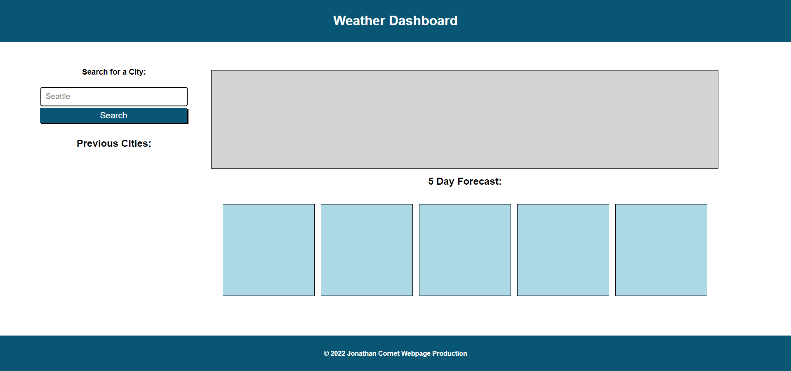
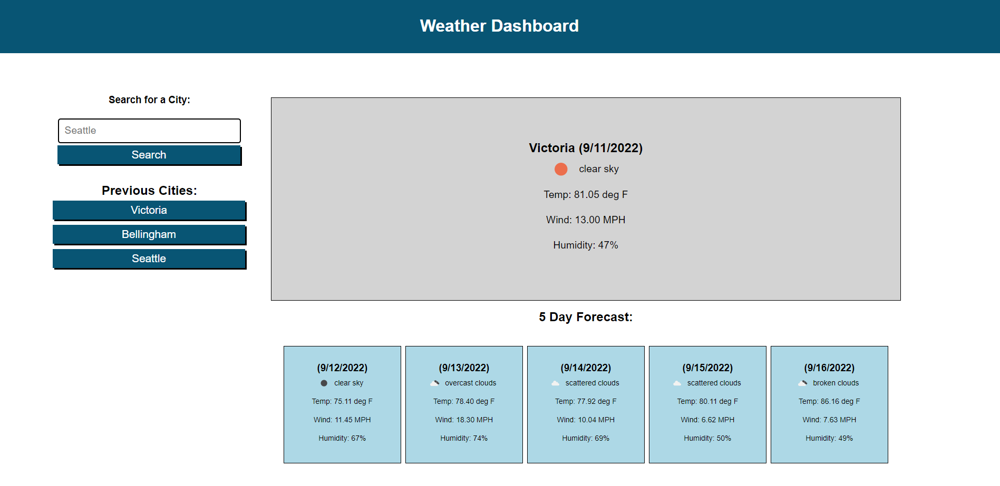

# Weather Dashboard


## Description

An application for finding weather data pertaining to the city selected by leveraging a third party API related to weather data. Furthermore, a button list is populated under the search bar relating to previous searchs made, which persists through local storage memory. The following User Story and Acceptance Criteria is also met:

## User Story

```
AS A traveler
I WANT to see the weather outlook for multiple cities
SO THAT I can plan a trip accordingly
```

## Acceptance Criteria

```
GIVEN a weather dashboard with form inputs
WHEN I search for a city
THEN I am presented with current and future conditions for that city and that city is added to the search history
WHEN I view current weather conditions for that city
THEN I am presented with the city name, the date, an icon representation of weather conditions, the temperature, the humidity, and the wind speed
WHEN I view future weather conditions for that city
THEN I am presented with a 5-day forecast that displays the date, an icon representation of weather conditions, the temperature, the wind speed, and the humidity
WHEN I click on a city in the search history
THEN I am again presented with current and future conditions for that city
```

The webpage looks as following:

## Initial page


## Example of Usage.


## Installation

No Installation is needed to view and use this webpage.

## Usage

In order to access the website, visit:

https://cornetj13.github.io/weather-dashboard/

## Credits

This project was designed by the UW fullstack bootcamp and was fully implemented by me. I referenced W3 Schools for JavaScript methods and functionality:

https://www.w3schools.com/

Furthermore, the third party API used is:

https://openweathermap.org/

## License

Please refer to the LICENSE in the repo.